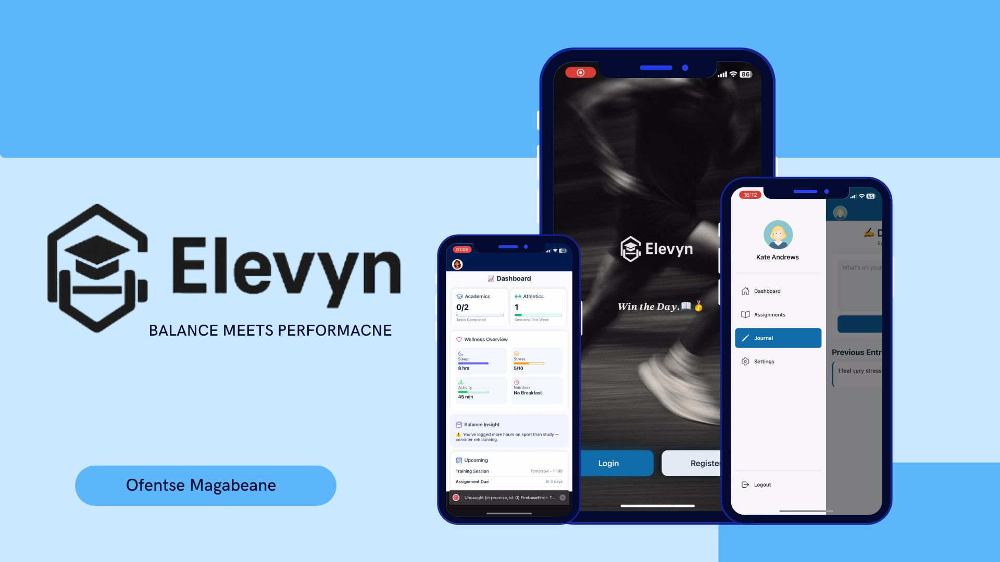

# Elevyn Student-Athlete App

# 📱 Elevyn App 

**Created:** 2025  
**Tools & Frameworks:** React Native, Figma, Expo, GitHub  
**Role:** Developer & UX/UI Designer 

---

##  What Is This App?

Elevyn is a mobile-first React Native app designed to support student-athletes in managing both their academic
and athletic responsibilities within a single, streamlined platform.

It combines essential features into one easy-to-use platform:

-💻**Authentication** – Users can log in and all their data will be stored dor their accounts
- 📆 **Weekly Planner/Task manager** – Users can add or view events (such as practice days, track assignments, game days)
- 🧘🏽‍♀️**Wellness Page** – Users can log their wellness metrics (ie. sleep, nutrition, mental health), access to recipies and mediations
- 🏅 **Performance Tracker** – This helps users keep their athletic stats to keep track of their perfromance

The app bridges the gap between existing learning management systems (LMS) and sports tracking tools by offering an integrated, user-friendly experience that reflects the dual life of a student-athlete.

---

## Screenshots

